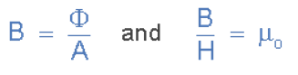
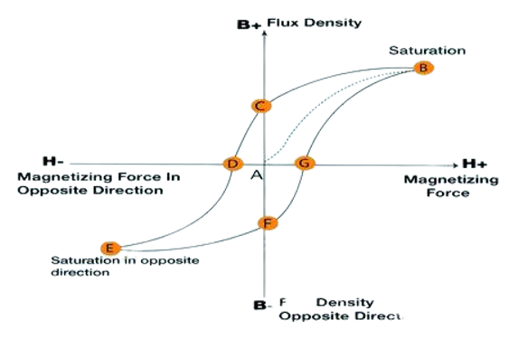

### Hysterisis: 
Hysteresis is based on a Greek word that means lagging. So Magnetic Hysteresis is all about how a material's magnetic properties lag behind the force that creates those properties.  The hysteresis curve tells us a lot about a material's response to a magnetic field, so if we know how to interpret it, we will know and understand a lot about the material's response to magnetic input.  

### BH-Curve: 
The plot of Hysteresis is known as a B-H curve, where B (The Material's Flux Density, measured in Teslas or Mega Gauss) is plotted on the vertical axis and H (The External Applied Magnetizing Force, measured in Amperes per meter) is plotted on the horizontal axis.  

### Circuit Diagram:

