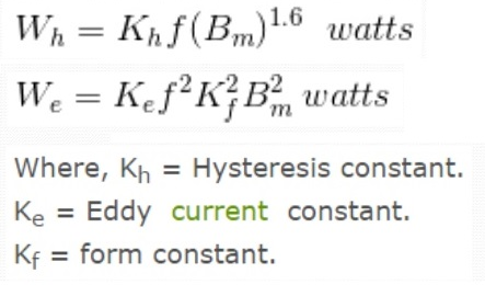

### Hysterisis: 
Hysteresis is based on a Greek word that means lagging. So Magnetic Hysteresis is all about how a material's magnetic properties lag behind the force that creates those properties.  The hysteresis curve tells us a lot about a material's response to a magnetic field, so if we know how to interpret it, we will know and understand a lot about the material's response to magnetic input.  

### BH-Curve: 
The plot of Hysteresis is known as a B-H curve, where B (The Material's Flux Density, measured in Teslas or Mega Gauss) is plotted on the vertical axis and H (The External Applied Magnetizing Force, measured in Amperes per meter) is plotted on the horizontal axis.  

### Circuit Diagram:

### Interpreting the Hysteresis Curve: 
1. The shape and size of the hysteresis loop provide valuable insights into the material's magnetic behavior.  
2. The width of the loop indicates the magnitude of the energy dissipated as heat during each cycle of magnetization and demagnetization. This energy loss is known as hysteresis loss and is represented by the area enclosed within the hysteresis loop.  
3. The coercivity (Hc) of the material, which represents the magnetic field strength required to reduce the material's magnetization to zero, can be determined from the hysteresis curve.  
4. Additionally, the remanence (Br) and saturation magnetization (Bs) of the material, which denote the residual magnetization and the maximum attainable magnetization under the applied field, respectively, can also be inferred from the hysteresis curve.

### Mathematical Representation: 
The hysteresis loss (Ph) in a ferromagnetic material can be quantified using the formula:
Ph = k * f * Bm * V  
Ph is the hysteresis loss.  
k is a material-specific constant.   
f is the frequency of the alternating magnetic field.  
Bm is the maximum magnetic flux density.  
α is the Steinmetz exponent.  
V is the volume of the material.  

Understanding the hysteresis curve and its associated parameters provides valuable information for the design and optimization of magnetic components and devices, such as transformers, inductors, and magnetic storage systems.
